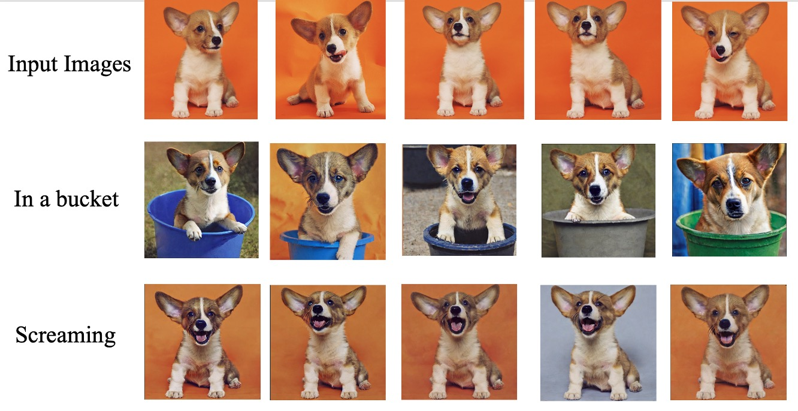

## Stable DreamBooth(Work in Progress)
This is an implementation of [DreamBooth](https://dreambooth.github.io/) based on [stable diffusion](https://github.com/CompVis/stable-diffusion).

## Results


## Requirements
### Hardware
- A GPU with at least 30G Memory.
- The training requires about 10 minites on A100 80G GPU with `batch_size` set to 4.

### Environment Setup
Create conda environment with pytorch>=1.11.
```bash
conda env create -f environment.yaml
conda activate stable-diffusion
```

## Quick Start
```bash
python sample.py # Generate class samples.
python train.py # Finetune stable diffusion model.
```
The generation results are in `logs/dog_finetune`.

## Finetune with your own data.

### 1. Data Preparation
1. Collect 3~5 images of an object and save into `data/mydata/instance` folder.
2. Sample images of the same class as specified object using `sample.py`.
    1. Change corresponding variables in `sample.py`. The `prompt` should be like "a {class}". And the `save_dir` should be changed to `data/mydata/class`.
    2. Run the sample script.
    ```bash
    python sample.py
    ```

### 2. Finetuning
1. Change the TrainConfig in `train.py`. 
2. Start training.
    ```bash
    python train.py
    ```

### 3. Inference
```bash
python inference.py --prompt "photo of a [V] dog in a dog house" --checkpoint_dir logs/dogs_finetune
```
Generated images are in `outputs` by default.

## Acknowledgement

- Stable Diffusion by CompVis https://github.com/CompVis/stable-diffusion
- DreamBooth https://dreambooth.github.io/
- Diffusers https://github.com/huggingface/diffusers